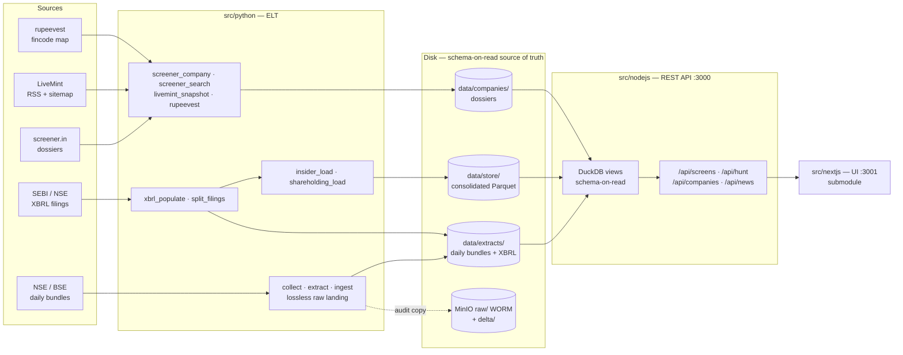
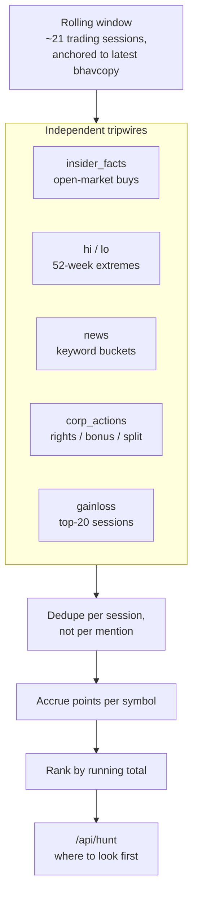
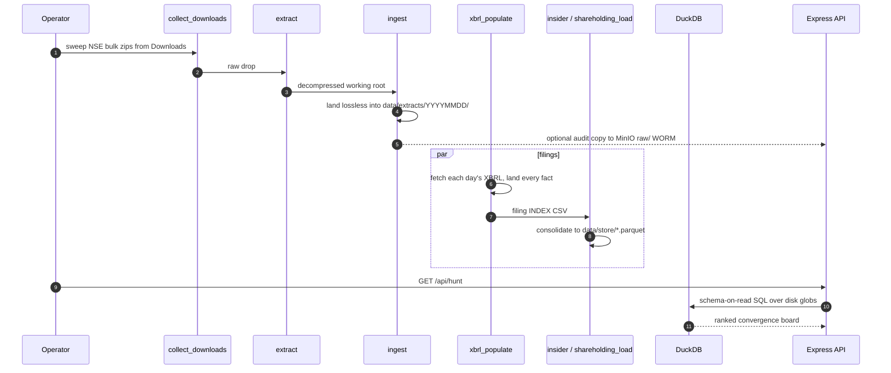

<div align="center">

# Fundamental-Screener — Idea-Generation Engine for Indian Equities

**An open-source ELT pipeline and screening API that turns NSE/BSE daily bundles, SEBI/NSE XBRL filings, screener.in dossiers and news into a ranked map of where market attention is concentrating — with no warehouse to operate.**

Every screen is DuckDB SQL read straight off Parquet and CSV on disk: schema-on-read, no loading step, no cluster. The **HUNT** scoreboard scores how independent signals *converge* on a single name — insider buying, new 52-week highs, corporate actions, news keywords — and floats the highest running total to the top. It ranks where to look first. It never says what to buy. Built with [DuckDB](https://duckdb.org/), [Express 5](https://expressjs.com/), [httpx](https://www.python-httpx.org/) and [Crawl4AI](https://github.com/unclecode/crawl4ai).

[](LICENSE.md)
[](https://www.python.org/)
[](https://expressjs.com/)
[](https://duckdb.org/)
[](https://parquet.apache.org/)
[](https://www.nseindia.com/)

*Keywords: stock screener · Indian equities · NSE BSE data pipeline · fundamental analysis · XBRL parsing · insider trading signals · shareholding pattern · 52-week high screen · DuckDB analytics · schema-on-read · ELT pipeline · web scraping · idea generation · equity research automation*

</div>

---

## What it does

**Signals over noise.** The pipeline lands raw exchange data losslessly, then reads it back as SQL. Nothing is transformed on the way in, so a bad parse is always re-runnable from the original bytes.

- **Lossless ELT, not ETL.** Daily NSE bundles land byte-for-byte in the raw drop and — optionally — in an object-locked MinIO `raw/` bucket (WORM, COMPLIANCE retention). Every downstream table is derived and disposable.
- **No warehouse.** DuckDB queries CSV and Parquet globs on disk directly. [`src/nodejs/src/db.js`](src/nodejs/src/db.js) mirrors [`src/python/screens.py`](src/python/screens.py) view-for-view, so the API and the CLI answer identically.
- **Convergence scoring.** HUNT assigns flat point values per signal over a rolling ~21-session window. Repetition accrues; routine filler scores zero by design.
- **Per-company dossiers.** Fundamentals, key ratios, 10-year financials, insider trades, shareholding and promoter history, resolved per symbol.
- **Scrapers that behave.** Paced, cached, `robots.txt`-respecting, and they never fabricate URLs — see [`context/sources.md`](context/sources.md).

### System context



### The HUNT convergence scoreboard

Point values come from the *Idea Hunting Framework* (Part 3), implemented in
[`src/nodejs/src/hunt.js`](src/nodejs/src/hunt.js). A name accrues points each time a signal
fires on it inside a rolling window; the highest running total floats to the top.

| Signal | Points | Counted as |
|---|---|---|
| Insider open-market buy | **5** | Per Market Purchase / Block Deal, deduped by (person, date, qty, value). ESOP, gift and off-market score 0; a sell is flagged, not scored |
| New 52-week high / low | **5** | First new high/low in the window, **+1** for each additional new-high/low session |
| News keyword | **3 / 2 / 1** | Strongest keyword per tagged article, once per stock |
| Corporate announcement | **2 / 1** | Rights = 2; Bonus / Split / Buyback = 1 |
| Daily gainer / loser | **1** | Per session the name sits in the top-20 |

Five rules keep it honest — signals count **per session, not per mention**; repetition
accumulates; routine "General/Business Update" filler carries no keyword and never climbs.
Two framework inputs are deliberately **not** wired because the data isn't there yet: the
volume ×1.5 confirmer (needs a per-stock volume baseline) and sector tailwind/headwind. They
sit at 0 rather than being faked.



### Daily pipeline



## Architecture

Three tiers, one direction of flow. Python owns extraction and loading; Node owns serving and
on-demand scraping; the UI is a separate repo.

| Path | Role |
|---|---|
| [`src/python/`](src/python/) | ELT — ingest, XBRL shred, loaders, scrapers, screens CLI (16 modules) |
| [`src/nodejs/`](src/nodejs/) | REST API — `src/server.js` routes, `src/db.js` DuckDB views |
| `src/nextjs/` | **submodule** → the Next.js UI ([hunt-internal](https://github.com/dvygo/hunt-internal)) |
| `data/extracts/` | Daily NSE/BSE bundles + XBRL cache — gitignored, re-fetchable |
| `data/store/` | Consolidated single-file filing stores (Parquet, derived) |
| [`data/companies/`](data/companies/) | Parsed per-symbol dossiers |
| [`context/`](context/) | Design notes, source assessment, plan, deploy guide, requirements |
| [`docker/`](docker/) | MinIO compose — WORM `raw/` bucket + `delta/` |
| [`setup/`](setup/) | `requirements.txt` |

**Python modules**

| Module | Does |
|---|---|
| `collect_downloads.py` · `extract.py` · `ingest.py` | Sweep NSE zips → decompress → land lossless |
| `xbrl_populate.py` · `split_filings.py` | Fetch filing XBRL, land every fact, split multi-day CSVs |
| `insider_load.py` · `shareholding_load.py` | Filing INDEX CSV → one consolidated Parquet |
| `screener_company.py` · `screener_search.py` | screener.in dossiers and authenticated full-text search |
| `livemint_snapshot.py` | Daily news-sitemap capture that accrues into history |
| `rupeevest_pull.py` · `rupeevest_stock_detail.py` · `build_rupeevest_index.py` | fincode ↔ NSE symbol map, resumable |
| `screens.py` | Layer A screens as DuckDB SQL over bhavcopy on disk |
| `nse_report_links.py` · `data_sync.py` | Bulk-download link generation; rclone → Drive sync |

**DuckDB views** (`db.js` mirrors `screens.py`): `prices` · `hi` · `lo` · `gainloss` ·
`circuit` · `corp_actions` · `insider_facts` · `shareholding_facts` · `promoter_history` ·
`mcap_latest` · `pe_latest`

## API

Express 5 on `:3000`. Every response is JSON.

| Route | Returns |
|---|---|
| `/api/hunt` | The convergence scoreboard |
| `/api/screens/52w-high` · `52w-low` (`/events`, `/last`) | New-extreme screens |
| `/api/screens/gainers` · `losers` (`/recurrence`) | Top movers, with repeat-appearance counts |
| `/api/screens/upper-circuit` · `lower-circuit` | Circuit hits |
| `/api/companies` · `/api/companies/:symbol/drilldown` | Search and per-company dossier |
| `/api/companies/:symbol/insider` · `/shareholding` · `/promoters` | Filing-derived history |
| `/api/insider/recent` | Recent insider activity across the market |
| `/api/corporate-actions` | Rights, bonus, split, buyback |
| `/api/news` · `/api/news/sitemap/today` · `/yesterday` | Stock-tagged news |
| `/api/fund-managers` · `/api/firms` · `/api/firm-search` | Manager and firm lookup |
| `/api/series` | Series metadata |

## Quickstart

```bash
# 1. Clone. The Next.js UI is a submodule in its own repo -- omit
#    --recurse-submodules if you do not have access; the API runs without it.
git clone git@github.com:dvygo/Fundamental-Screener.git
cd Fundamental-Screener

# 2. Python ELT
python -m venv .venv && source .venv/bin/activate
pip install -r setup/requirements.txt
playwright install chromium            # only if a scraper needs the browser

# 3. Storage -- optional MinIO WORM audit layer
docker compose -f docker/docker-compose.yml up -d

# 4. API on :3000
cd src/nodejs && npm install && node src/server.js

# 5. UI on :3001 -- needs the API up, and access to the submodule
cd src/nextjs && npm install && npm run dev
```

Full run and deploy story: [`context/DEPLOY.md`](context/DEPLOY.md). Layered design:
[`context/PLAN.md`](context/PLAN.md).

## Configuration

No credentials are committed. Local secrets live in gitignored files:

| File | Holds |
|---|---|
| `src/nodejs/.env` | screener.in credentials, API settings |
| `docker/.env` | `MINIO_ROOT_USER` / `MINIO_ROOT_PASSWORD` — defaults are `minioadmin`, change them |
| `/.data-sync.env` | rclone config and shared-drive id |
| Google service-account JSON | Drive sync key — copied to each server by hand, **never committed** |
| TLS key / cert | The API's optional HTTPS listener |

## Sources & etiquette

screener.in is used by explicit choice. Scrapers **cache and pace**, respect `robots.txt`, and
**never fabricate URLs**. Read [`context/sources.md`](context/sources.md) before touching any
scraper, and [`CONTRIBUTING.md`](CONTRIBUTING.md) before opening a PR.

Sibling project: [Fund-Manager-Web-Scraper](https://github.com/dvygo/Fund-Manager-Web-Scraper).

## Tech stack

`Python 3.11+` · `httpx` · `BeautifulSoup` / `lxml` · `Crawl4AI` (Playwright) · `feedparser` ·
`Parquet` · `DuckDB` · `Node.js` · `Express 5` · `cheerio` · `esbuild` · `MinIO` (S3, WORM) ·
`Next.js`

## Disclaimer

Fundamental-Screener is provided **as is, without warranty of any kind**, express or implied.
It is research tooling — **not financial advice**, not a recommendation to buy or sell any
security, and not a solicitation. The HUNT board ranks where attention is concentrating; a high
score is a prompt to investigate, never a signal to trade. Data is scraped and parsed from
third-party sources and **will** contain errors, gaps and stale values; verify anything you act
on against the primary filing. You are solely responsible for your own investment decisions and
for complying with the terms of service of every source you fetch and with any securities
regulation that applies to you. Source names appear only to describe integration points; no
affiliation or endorsement is implied.

## License

BSD 3-Clause — see [`LICENSE.md`](LICENSE.md).

Copyright (c) 2026, dvygo (Deshik Narasimha)
